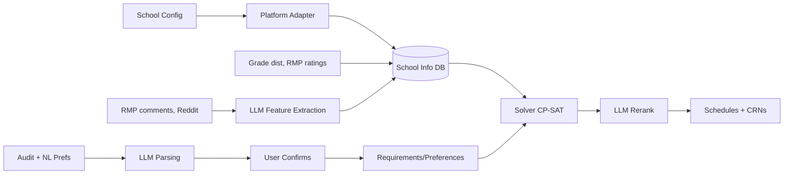

# Architecture

```mermaid
flowchart LR
  A[School Config] --> B[Platform Adapter] --> DB[(School Info DB)]
  G[Grade dist, RMP ratings] --> DB
  T[RMP comments, Reddit] --> F[LLM Feature Extraction] --> DB
  P[Audit + NL Prefs] --> L[LLM Parsing] --> U[User Confirms] --> R[Requirements/Preferences]
  DB --> S[Solver CP-SAT]
  R --> S --> K[LLM Rerank] --> O[Schedules + CRNs]
```

