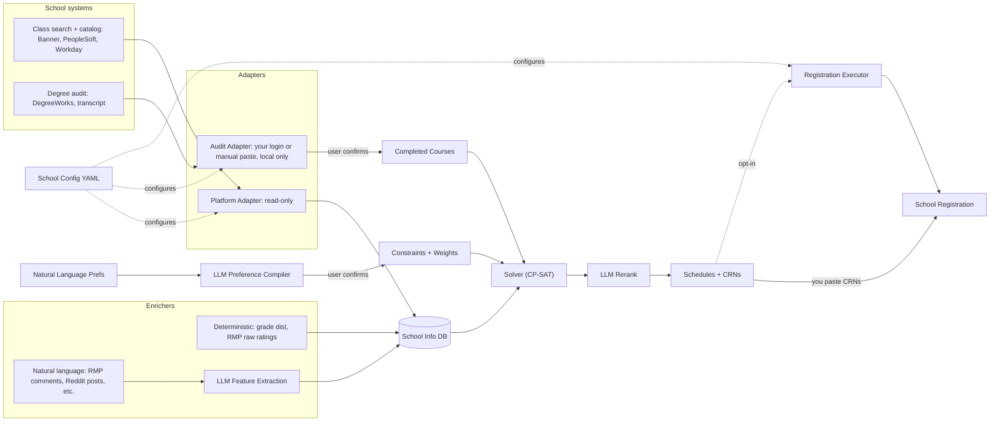

# Architecture

```mermaid
flowchart LR
  subgraph School["School systems"]
    CS[Class search + catalog: Banner, PeopleSoft, Workday]
    DW[Degree audit: DegreeWorks, transcript]
  end

  subgraph Adapters
    PA[Platform Adapter: read-only]
    AA[Audit Adapter: your login or manual paste, local only]
  end

  CFG[School Config YAML] -. configures .-> PA
  CFG -. configures .-> AA
  CFG -. configures .-> RE

  subgraph Enrichers
    G["Deterministic: grade dist, RMP raw ratings"]
    NLE["Natural language: RMP comments, Reddit posts, etc."] --> F[LLM Feature Extraction]
  end

  CS --> PA --> DB[(School Info DB)]
  G --> DB
  F --> DB
  DW --> AA -->|user confirms| H[Completed Courses]
  NL[Natural Language Prefs] --> PC[LLM Preference Compiler] -->|user confirms| W[Constraints + Weights]

  DB --> S["Solver (CP-SAT)"]
  H --> S
  W --> S
  S --> K[LLM Rerank] --> O[Schedules + CRNs]

  O -->|you paste CRNs| REG[School Registration]
  O -. opt-in .-> RE[Registration Executor] --> REG
```

